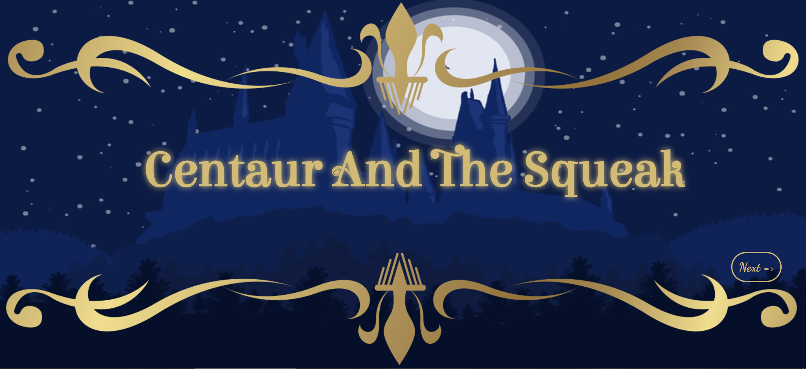
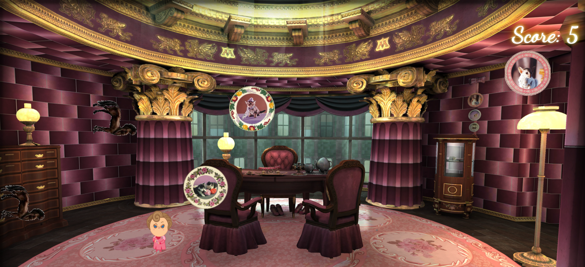
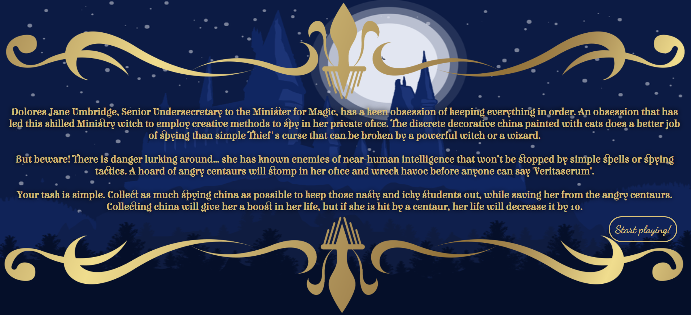

# Object Oriented Programming Game Project
The aim of this project is to modify the cat game with our creative ideas using HTML, CSS and Javascript concepts. 

## Centaur and the Squeak

The name of the game is derived from a chapter from Harry Potter and the Order of the Phoenix, **Centaur and the Sneak**. The game has multiple "objects" falling from the top, and the player (Dolores Umbridge) has to either catch them, or get away from them. The objects to catch are circular china with cat prints that give her life, and the objects to avoid are the centaurs that take away life. As soon as the lives reaches 0, that means the player has failed and the game is finished.

Following is the picture of the gameplay.

## Changes made
- An introduction page was made with the title, a "Next=>" button, and two different overlapping images.
- A second page was designed that describe a set of rules and the "Start Playing" button. 
- The introduction page and the rules page have a particular music playing in the background.
- Changes in the gameplay are described below.
    - The main background was changed to a different background, and the size of the game was changed to full browser view.
    - The concept of the game was changed to include two different set of objects falling from the top. The circular china adds +1 life when caught, while the centaur removes the life by 10 when hit.
    - For the different objects, a `kittyhaus.js` file was created that housed different animals with particular identifiers.
    - This page also has it own specific music.
    - A check was added to the score/life (the default is 3), i.e. whenever it becomes zero, the game would be over. 
    - The maximum objects falling at any given moment are 6.
- On the game over page, an image is displayed with black background, a game over text, and a replay button.
- This part also has its own specific audio.
- Clicking on the replay button takes the player to the gameplay again, and the life is reset to 3.

## Other images

## Netlify link

https://pedantic-hopper-3fc9bf.netlify.app

So put your headphones on with volume at full....and play on!