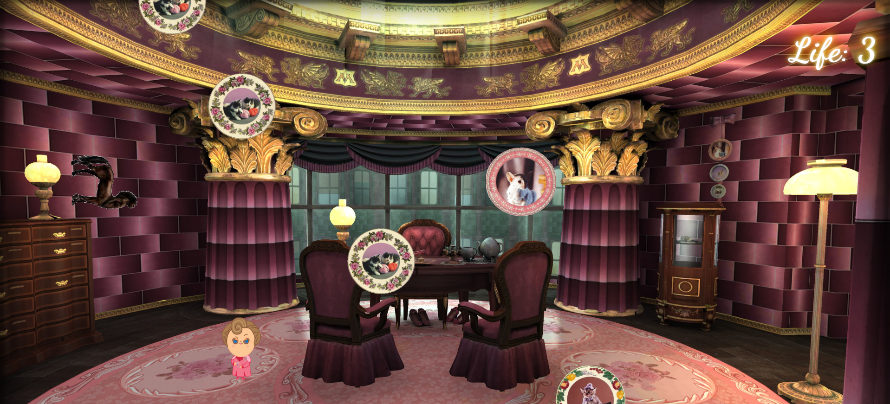

# Object Oriented Programming Game Project
The aim of this project is to modify the cat game with our creative ideas using HTML, CSS and Javascript concepts. 

# Centaur and the Squeak

The name of the game is derived from a chapter from Harry Potter and the Order of the Phoenix **Centaur and the Sneak**. The game has multiple "objects" falling from the top, and the player (Dolores Umbridge) has to either catch them, or get away from them. The objects to catch are circular china with cat prints that give her life, and the objects to avoid are the centaurs that take away life. As soon as the score reaches 0, that means the player has failed and the game is finished.

Following is the picture of the game play.

